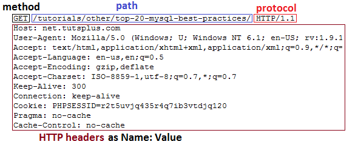
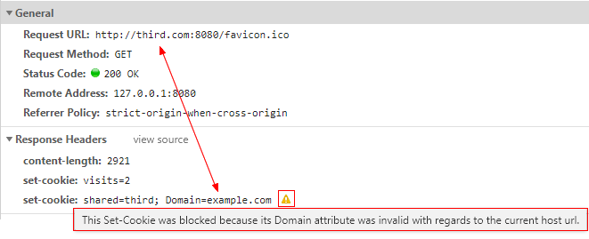
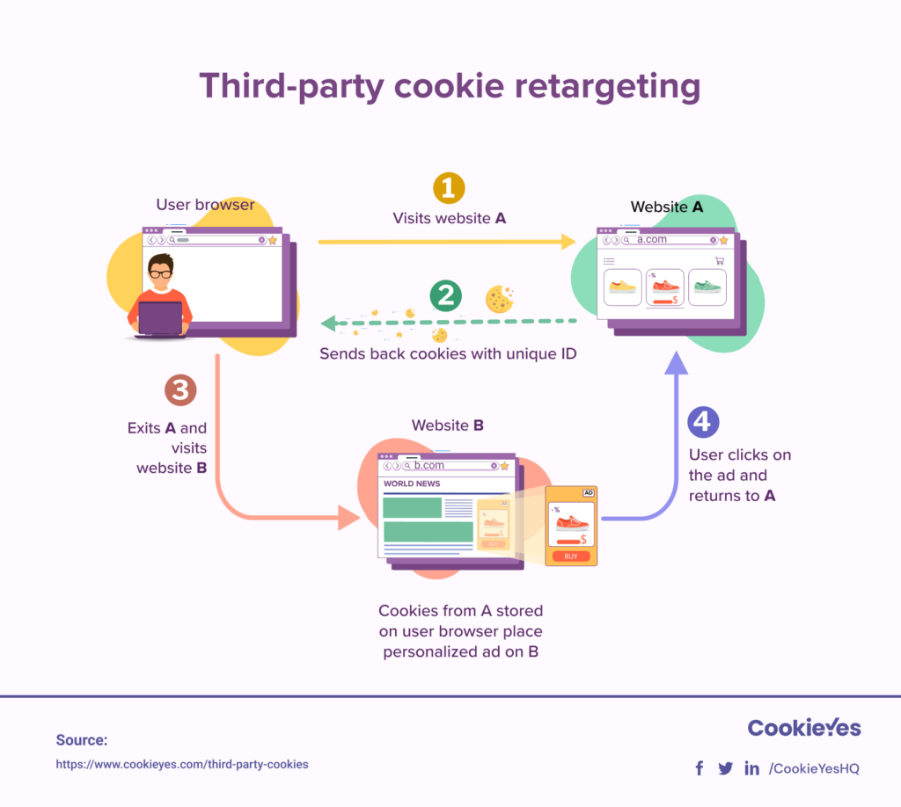

# Cookies HTTP


> Cookie é um arquivo de texto simples armazenado pelo navegador, que possui a função de guardar uma série de informações sobre o visitante e a sua navegação.

Fonte: [HostGator](https://www.hostgator.com.br/blog/o-que-sao-os-cookies-da-web/)

Um cookie HTTP também pode ser interpretado como um pequeno fragmento de dados que um servidor enviar para o navegador do usuário. O navegador, assim, pode armazenar estes dados e enviá-los de volta na próxima requisição para o mesmo servidor.

<p align="center">
    
</p>
<p align="center">
    <em>Figura 01: Funcionamento Cookies</em>
</p>

**Usos dos Cookies**

* **Gerenciamento de sessão**: são atividades registradas no servidor como logins, carrinhos de compra, placar de jogos, entre outros exemplos.
* **Personalização**: configurações específicas pra um determinado usuário, como as suas preferências, temas, entre outros.
* **Rastreamento**: registro e análise do comportamento de um usuário.

---

## Tipos de Cookies

### Session Cookie

Fica ativo enquanto a sessão do navegador está aberta. Assim que o navegador é fechado, as informações são deletadas.

### Persistent ou Permanent Cookie

São cookies que permanecem armazenados mesmo após sair do site ou fechar o navegador. **O tempo da sua expiração é definido pelo desenvolvedor**. 

É preciso ressaltar, que o usuário pode sempre apagar os cookies através das configurações do navegador.

### Third-Party Cookies

São cookies compartilhados por diversos domínios e acessados por aplicações de terceiros. Um caso clássico são as redes de anúncios que utilizam esse tipo de cookie para personalizar os anúncios dos usuários em diferentes sites.

### Supercookie

É um Cookie de rastreamento que permite acompanhar todos os movimentos do usuário na internet e, diferentemente dos outros tipos, não está armazenado no computador. Logo, não pode ser bloqueado ou excluído.

### Zombie Cookie

É um tipo de Cookie que volta à ativa mesmo após ser excluído, sendo conhecido também como **Evercookie**.

### Outras Classificações Importantes

* **Secure Cookie**: para garantir a segurança, só aceita conexão do tipo ***https***;
* **Http-only-cookie**: exige que o acesso seja feito através de uma conexão http, evitando que o arquivo seja alterado por um JavaScript mal intencionado;
* **Same-Site Cookie**: faz com que os servidores só aceitem requisição de um mesmo site. Isso também serve para segurança da informação, protegendo de requisições forjadas.

---

## Aonde os Cookies são configurados?

> Os cookies tanto nas requisições quanto nas respostas são configurados no **Header HTTP**.

<p align="center">
    
    
</p>
<p align="center">
    <em>Figura 02: Request e Response HTTP Header</em>
</p>

### Back-end

No **back-end** os cookies são configurados no header HTTP através cabeçalho `Set-Cookie`. Por padrão esse cebeçalho é composta da seguinte forma:

```
Set-Cookie: <nome-cookie>=<valor-cookie>
Set-Cookie: <nome-cookie>=<valor-cookie>; Expires=<date>
Set-Cookie: <nome-cookie>=<valor-cookie>; Max-Age=<non-zero-digit>
Set-Cookie: <nome-cookie>=<valor-cookie>; Domain=<domain-value>
Set-Cookie: <nome-cookie>=<valor-cookie>; Path=<path-value>
Set-Cookie: <nome-cookie>=<valor-cookie>; Secure
Set-Cookie: <nome-cookie>=<valor-cookie>; HttpOnly

Set-Cookie: <nome-cookie>=<valor-cookie>; SameSite=Strict
Set-Cookie: <nome-cookie>=<valor-cookie>; SameSite=Lax

// São possíveis multiplas diretivas, por exemplo:
Set-Cookie: <nome-cookie>=<valor-cookie>; Domain=<domain-value>; Secure; HttpOnly
```

Fonte: [MDN](https://developer.mozilla.org/pt-BR/docs/Web/HTTP/Headers/Set-Cookie)

### Front-end

No **front-end** para enviar o cookie basta configurar o cabeçalho `Cookie`. Por padrão esse cebeçalho é composta da seguinte forma:

```
Cookie: <cookie-list>
Cookie: name=value
Cookie: name=value; name2=value2; name3=value3
```

Fonte: [MDN](https://developer.mozilla.org/pt-BR/docs/Web/HTTP/Headers/Cookie)

---

## Diferenças entre lacalStorage e cookies

* O armazenamento disponível para o localStorage é em torno de **5MB**, que é muito maior em relação ao espaço típico para um cookie, que é em torno de **4KB**;

* Uma característica importante é que a toda requisição realizada pelo navegador os cookies designados à aquele site são enviados de volta ao servidor. Isso proporciona o **aumento de tráfego na rede**. Diferentemente, informações no localStorage são enviados ao servidor se o programador definir que elas deverão ser enviadas;

* Os dados armazenados no localStorage persistem até serem excluídos explicitamente. As alterações feitas são salvas e estão disponíveis para todas as visitas atuais e futuras ao site;

* Os dados armazenados só estarão na mesma origem. Diferentemete, há tipos de cookies que podem ser compartilhados entre navegadores e máquinhas distintas.

Fonte: [Mateus Gabriel Barbosa](https://medium.com/@desenvolvedormateusbarbosa/qual-%C3%A9-a-diferen%C3%A7a-entre-sessionstorage-localstorage-e-cookies-93b49eea747c)

---

## Third-party Cookies

<p align="center">
    
</p>
<p align="center">
    <em>Figura 03: Third-party Cookies</em>
</p>


A personalização dos anúncios para um determinado usuário acontece através dos **Third-party Cookies**. Esses cookies são padronizados e compartilhados por uma série de empresas, geralmente de uma mesma rede, em que ao acessar um determinados sites os seus cookies são salvos e "reutilizados" ao acessar outro site distinto. 

Imagine o seguinte caso, ao acessar um site A sobre uma loja de esportes, cookies são salvos identificando quais foram os produtos mais pesquisados. Dessa forma, ao acessar outro site B, que possui propagandas, aparecerão justamente anúncios dos produtos que foram pesquisados no site A. Isso acontece porque o site B foi capaz de identificar essas informações através dos cookies salvos pelo site A.

Esses tipos de cookies estão ao meio de uma grande discussão sobre a privacidade dos dados. Assim, é sempre preciso tomar cuidado ao utilizar sites e olhar a sua política de dados.
